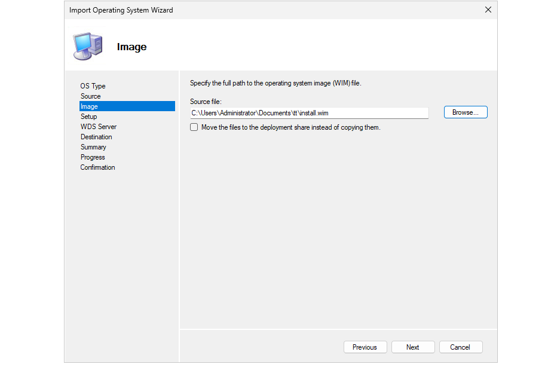

# MDT installation and configuration
this will be a follow up to my wds folder so if you haven't read it yet go do it. So before we start with mdt we need to install the application from this link from the official microsoft page
```
https://www.microsoft.com/en-us/download/details.aspx?id=54259&msockid=35f2171393de6b4f1908013e921e6ae8
```

## MDT initial configurations
The application name will usually be Deployment workbench.


In the application right click on deployment share and select create a new deployment share


make sure the following option are selected


Right click on your deployment share and select property
deselect x86 because we are using x64


after deselecting x86 and going into Windows PE you will recieve this error 


I think this error appears because there is missing a folder.

to fix this problem i followed this person guide
```
https://www.dannymoran.com/microsoft-deployment-workbench-windows-pe-x86-crash/
```
I used the manual version so i went to this location: C:\Program Files (x86)\Windows Kits\10\Assessment and Deployment Kit\Windows Preinstallation Environment. Copied the file amd64 and pasted it and renamed it to x86 and the problem was fixed.


Now just select apply 
now we will create a folder for the operating system i will name it Win2022


Now select import operating system


in the first section slect custom image file. after that enter the path to your install.wim file you used for wds.



select next for the rest until you arrive here


Now we will create a task
after entering the task name and kept the template to default select the following image. don't use the core version cause those are servers without gui


in the next part enter a username and your domain of your network and than click next

## google and firefox configurations

make sure to download the msi file for firefox anf google from these sites
```
https://chromeenterprise.google/browser/download/
https://www.mozilla.org/en-US/firefox/enterprise/#download
```

now let start with google make a new folder named google then make a new app in the folder. select next


Enter the name of the app you downloaded


In the command line section add the following command
```
msiexec.exe /i "GoogleChromeStandaloneEnterprise64.msi" /qn
```


Now repeat the same steps for the firefox.
I have a little problem. because i selected the complete download folder it copied everything to the C:\DeploymentShare\Applications google and firefox folder. so it would be better to create a specific folder put the google...msi file and antoher folde for the firefox...msi file. since i didn't i will go in each folder and delete all the unecessary stuff.

## configuration file
in this part i will give you information on how i did my configuration file
When you go on your deployment share propeties and you go on the rules section you should get this by fefault.


i will give you a file in this folder name customsetting.ini with the information you need to enter. 

as you can see i the file all of the skip have a value = no for a good reason. before testing on a real machine we can test it on the mdt/wds server it self to see if the configuration work. After creating the boot image in the next part go to this location: C:\DeploymentShare\Scripts. You should find 1 or two files named LiteTouch.

## bootstrap init
almost forgot there are a few information you have to add to bootstrap init that is located in: C:\DeploymentShare\Control.

the file should look like this
```ini
[Settings]
Priority=Default

[Default]
DeployRoot=\\WDS\DeploymentShare$
```

bur you after you add the 3 lines it should look like thi

```ini
[Settings]
Priority=Default

[Default]
DeployRoot=\\WDS\DeploymentShare$
UserID=administrator
UserDomain=victim.local
UserPassword=adminpassword
SkipBDDWelcome=YES
```


run any of them to test your configuration


If everything work you should be able to try it on a real machine.
Also in my script you might see these 2 lines.
```
MandatoryApplications001={b87c6fb7-832e-4890-a741-c2a8f7615c98}
MandatoryApplications002={6446151c-2aab-41c1-b09f-8da82ad797c3}
```
These are the lines that select which application to install automaticly for me google and firefox in that order. For every user the {...} part will be different. to find what information to put follow my instruciton .

Go in the google folder and you should see the applications


click on the application then select properties and you should see this 


copy the application guid to your script and when you lauch the litetouch google should be selected. do the same step for firefox. 

## creating new boot image

right click on the your deployment share and select update ...


select the second option because we want to create a whole new image.
after clicking on next it will take a couple of minutes to create image.

## final part
The last thing to do before trying out our service is to change the boot image of our WDS to our new boot image we created.

first i will disable the old boot image i used then i will create a new one


# deployment
Since im using vmware i will create a blank virtual machine and run it


i had a tiny little problem. usually it supposed to have no intervention from the end user but after installing the os a product key page appears and i had to select skip. This shouldn't of happend cause i did select skipproductkey but its not the end of the world.
