# WDS
In this file i will show you how to use WDS to automaticly installed a preconfigured Windows server. I Will use 2 machine 1 machine which will have ad AND dhcp and another server with WDS.
my server IP will be 10.10.10.10 for AD and 10.10.10.11 for WDS
i used this link for help
```
https://rdr-it.com/wds-installation-et-configuration/
```
## Installing WDS 
i assume you already know how to install AD and dhcp so now i will install WDS. 

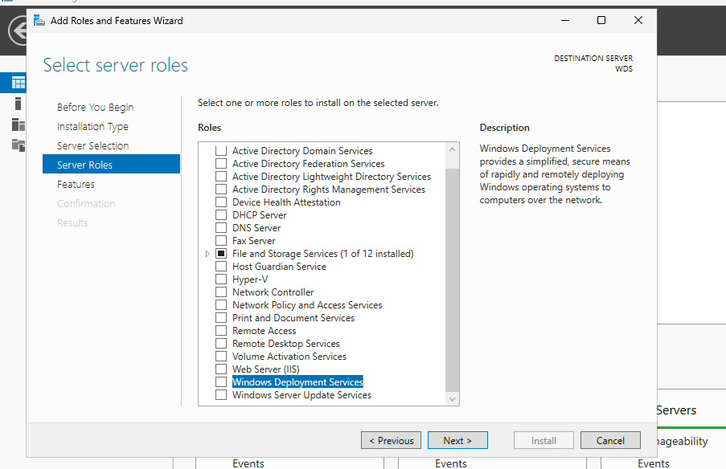<br>
after selecting the service just do next and next and install. after the installation make sure you connect the WDS server to the domain of the other server. also make sure to make another drive/ partition. i used a 60GB drive and made it a E: drive.

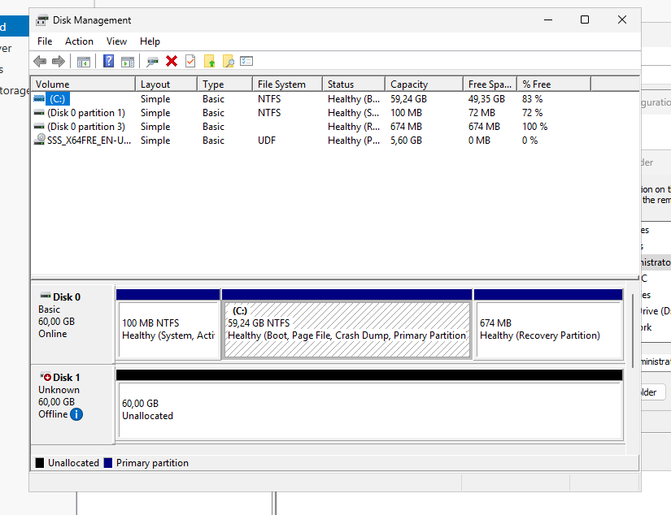

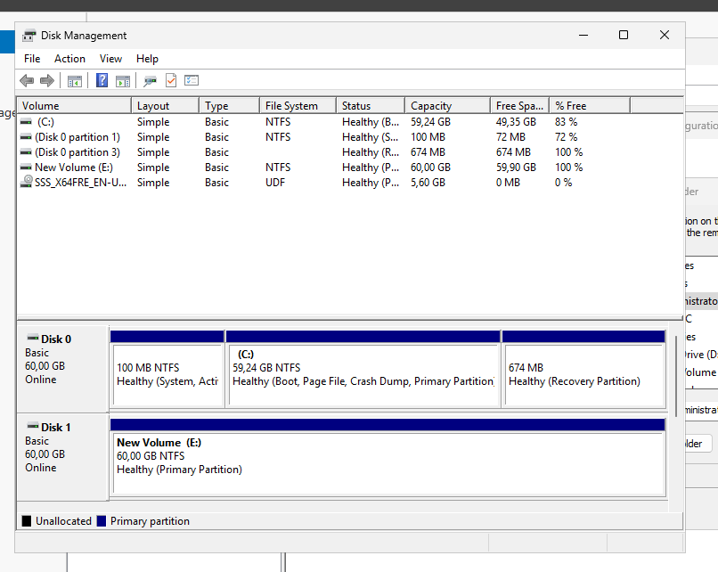

After creating the partition and adding the host to the domain we can finally configure our WDS server.

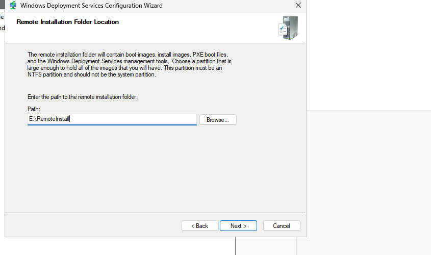<br>
as you can see i used the second drive.

now we are going to add the boot images. first of all extract the boot.wim and install.wim from a iso. i took a windows server 2025 iso.

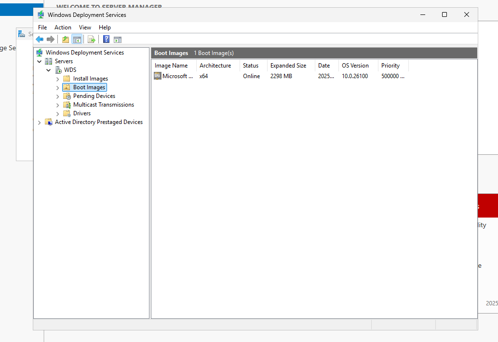<br>
After this we are going to creat a group of imasges then add are install.wim to it

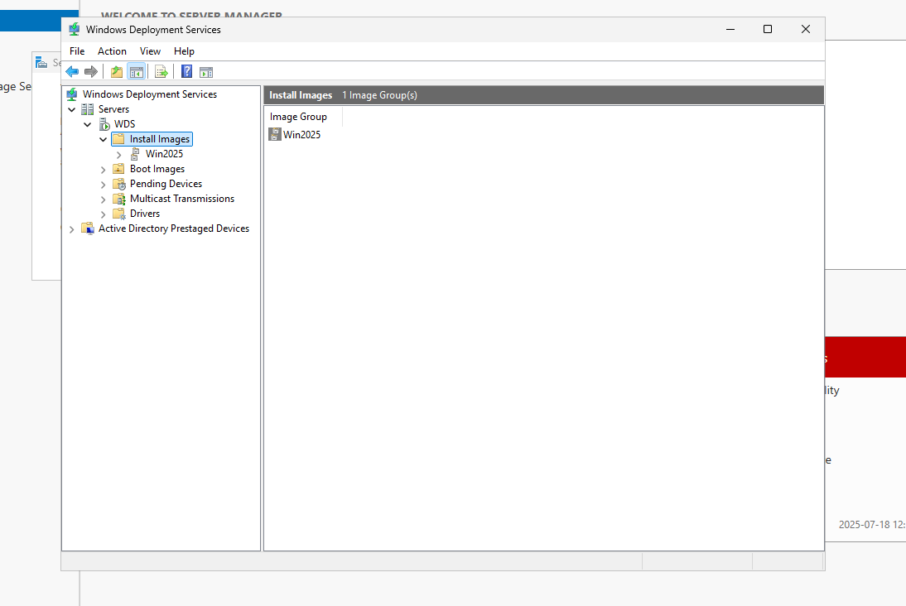<br>

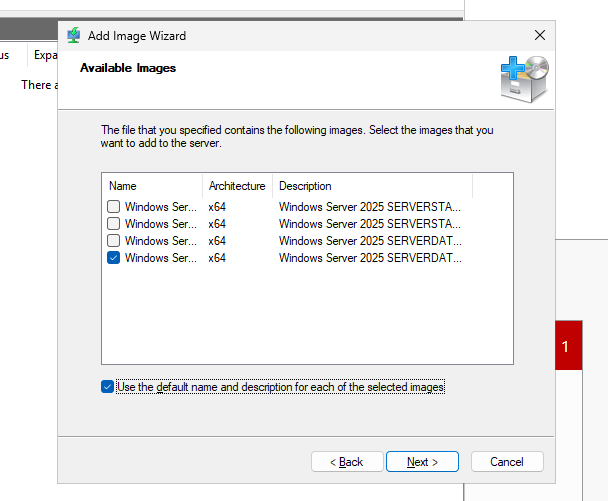<br>
make sure to select the proper image or you might install a CLI only Windows server

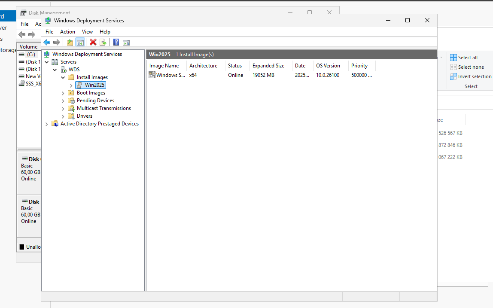<br>


## Configuring dhcp
before we can try wds we need to configure dhcp and option lik 66 and 67 

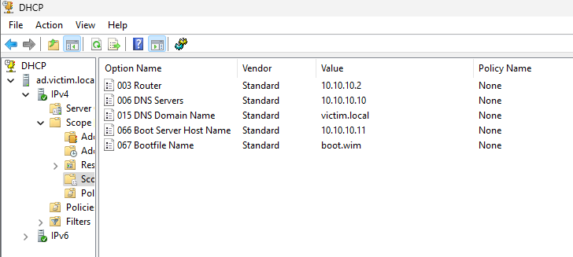<br>

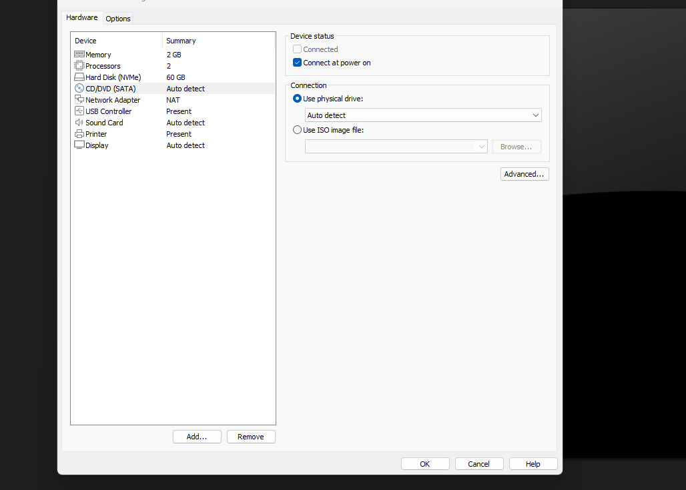


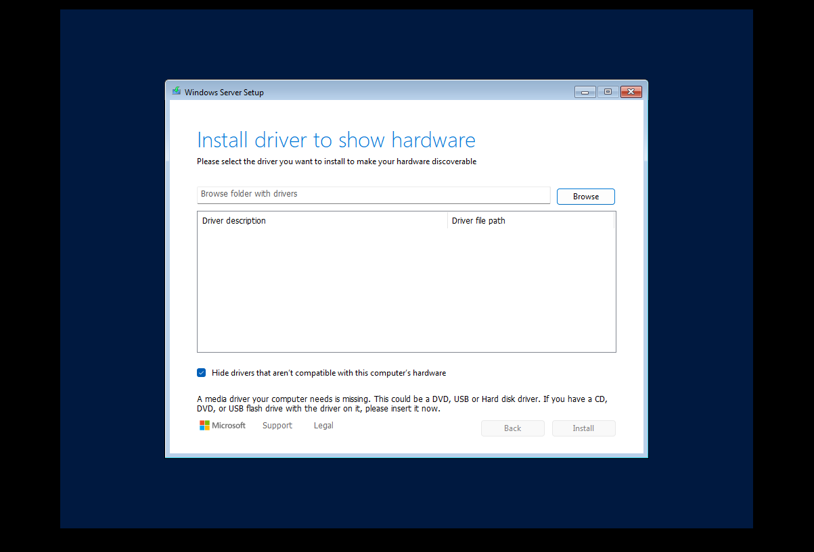
i encountered a problem when trying to install windows server 2025 with wds so i decided to use another version of windows server win2022.

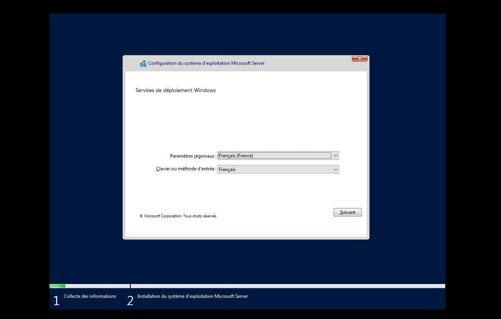
this shows that WDS work but i want it to install without my intervention so we have to do more steps.

## ADK
we need to install windows adk to be able to continue uste this link and use the pe add on ... and adk
```
https://learn.microsoft.com/en-us/windows-hardware/get-started/adk-install
```

 
## after
After installing Windows system image manager and creating a file .xml do this. I will give my xml file in the following folder also my iso is 
```
...
```

first add the files to wds
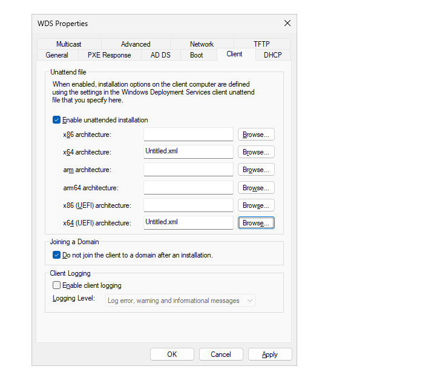

after add the file to the install image in wds

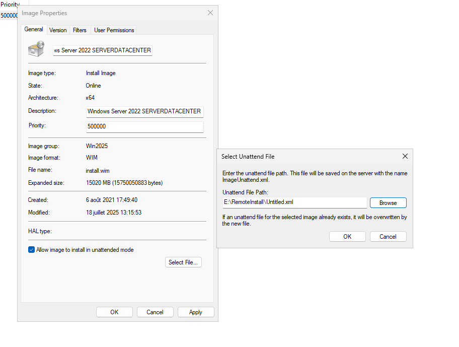

also there is a driver section that migght solve the windows2025 driver problem i had.
Anyway after adding the xml file you can start a machine or VM with no OS.

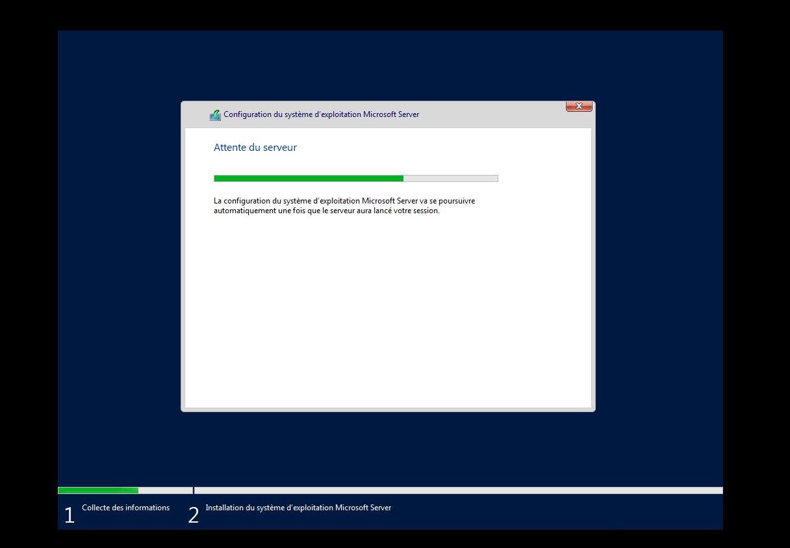

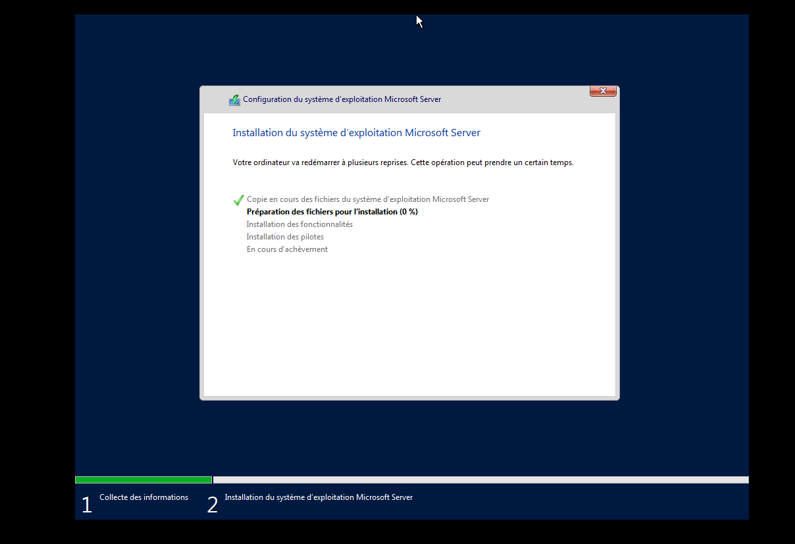

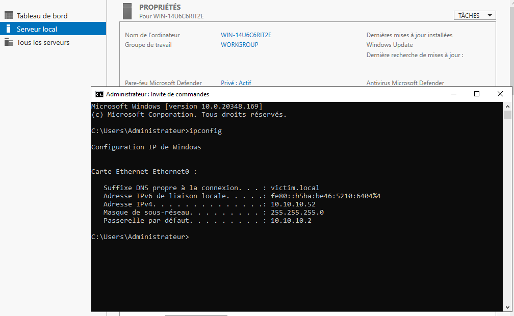


in the next part i will show youi how to use mdt with wds. also i was in a rush so this README me be worse than the others.